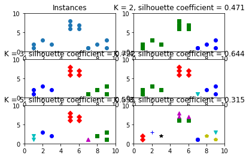
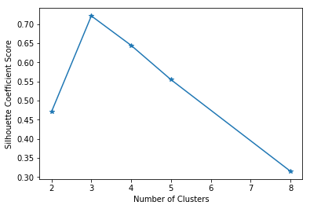
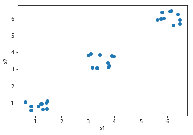

### 代码47：k-means算法在手写体数字图像上的使用示例


```python
import numpy as np
import matplotlib.pyplot as plt
import pandas as pd
# 上网读取训练和测试数据集
digits_train = pd.read_csv('https://archive.ics.uci.edu/ml/machine-learning-databases/optdigits/optdigits.tra', header = None)
digits_test =  pd.read_csv('https://archive.ics.uci.edu/ml/machine-learning-databases/optdigits/optdigits.tes', header = None)
```


```python
# 从训练与测试数据集上都分离出64维度的像素特征与1维度的数字目标
X_train = digits_train[np.arange(64)]
y_train = digits_train[64]
X_test = digits_test[np.arange(64)]
y_test = digits_test[64]
```


    1797


```python
# 从sklearn.cluster中导入K-Means模型
from sklearn.cluster import KMeans
# 初始化模型，并设置聚类中心数量为10
kmeans = KMeans(n_clusters = 10)
kmeans.fit(X_train)
# 逐条判断每个测试图像所属的聚类中心
y_pred = kmeans.predict(X_test)
```

***作者提供两种方式对聚类算法结果进行性能评估。***  
一. ARI指标，如果被用来评估的数据本身带有正确的类别信息，就可以用这个指标。ARI指标与分类问题中计算准确性（accuracy）的方法类似，同时也兼顾到了类簇无法和分类标记一一对应的问题。

### 代码48：使用ARI进行K-Means聚类性能评估


```python
from sklearn import metrics
print(metrics.adjusted_rand_score(y_test, y_pred))
```

    0.6668279862044629
    

二. 如果被用于评估的数据没有所属类别，那么我们习惯使用轮廓系数（Silhouette Coefficient）来度量聚类结果的质量。轮廓系数同时兼顾了聚类的凝聚度（Cohesion）和分离度（Separation），用于评估聚类的效果并且取值范围[-1,1]。轮廓系数值越大，表示聚类效果越好。

### 代码49：使用轮廓系数评价不同类簇数量的K-Means聚类实例


```python
import numpy as np
from sklearn.cluster import KMeans
from sklearn.metrics import silhouette_score
import matplotlib.pyplot as plt

#分割出3*2=6个子图，并在1号子图做图
plt.subplot(3,2,1)
# 初始化原始数据点
#x1 = np.array([1, 2, 3, 1, 5, 6, 5, 5, 6, 7, 8, 9, 7, 9])
#x2 = np.array([1, 3, 2, 2, 8, 6, 7, 6, 7, 1, 2, 1, 1, 3])
#X = np.array(zip(x1, x2)).reshape(len(x1), 2)
X = [[1,1], [2, 3], [3, 2], [1, 2], [5, 8], [6, 6], [5, 7], [5, 6], [6, 7], [7, 1], [8, 2], [9, 1], [7, 1], [9, 3]]

# 在1号子图做出原始数据点阵的分布
plt.xlim([0, 10])
plt.ylim([0, 10])
plt.title('Instances')
plt.scatter(x1, x2)
colors = ['b', 'g', 'r', 'c', 'm', 'y', 'k', 'b']
markers = ['o', 's', 'D', 'v', '^', 'p', '*', '+']

clusters = [2, 3, 4, 5, 8]
subplot_counter = 1
sc_scores = []
for t in clusters:
    subplot_counter += 1
    plt.subplot(3, 2, subplot_counter)
    kmeans_model = KMeans(n_clusters = t).fit(X)
    
    for i, l in enumerate(kmeans_model.labels_):
        plt.plot(x1[i], x2[i], color = colors[l], marker = markers[l], ls = 'None')
        plt.xlim([0, 10])
        plt.ylim([0, 10])
    sc_score = silhouette_score(X, kmeans_model.labels_, metric = 'euclidean')
    sc_scores.append(sc_score)
    # 绘制轮廓系数与不同类簇数量的直观显示图
    plt.title('K = %s, silhouette coefficient = %0.03f'%(t, sc_score))
# 绘制轮廓系数与不同类簇数量的关系曲线
plt.figure()
plt.plot(clusters, sc_scores, '*-')
plt.xlabel('Number of Clusters')
plt.ylabel('Silhouette Coefficient Score')

plt.show()

```








### 代码50：“肘部”观察法示例


```python
import numpy as np
from sklearn.cluster import KMeans
from scipy.spatial.distance import cdist
import matplotlib.pyplot as plt
# 使用均匀分布函数随机三个簇，每个簇周围10个数据样本
cluster1 = np.random.uniform(0.5, 1.5, (2,10)) 
cluster2 = np.random.uniform(5.5, 6.5, (2,10)) 
cluster3 = np.random.uniform(3.0, 4.0, (2,10))  

#绘制30个数据样本的分布图像
X = np.hstack((cluster1, cluster2, cluster3)).T
plt.scatter(X[:,0], X[:, 1])
plt.xlabel('x1')
plt.ylabel('x2')
plt.show()

# 测试9种不同聚类中心数量下，每种情况的聚类质量，并做图。
K = range(1, 10)
meandistortions = []

for k in K:
    kmeans = KMeans(n_clusters = k)
    kmeans.fit(X)
    meandistortions.append(sum(np.min(cdist(X, kmeans.cluster_centers_, 'euclidean'), axis = 1))/ X.shape[0])

plt.plot(K, meandistortions, 'bx-')
plt.xlabel('k')
plt.ylabel('Average Dispersion')
plt.title('Selecting k with the Elbow Method')
plt.show()
```





